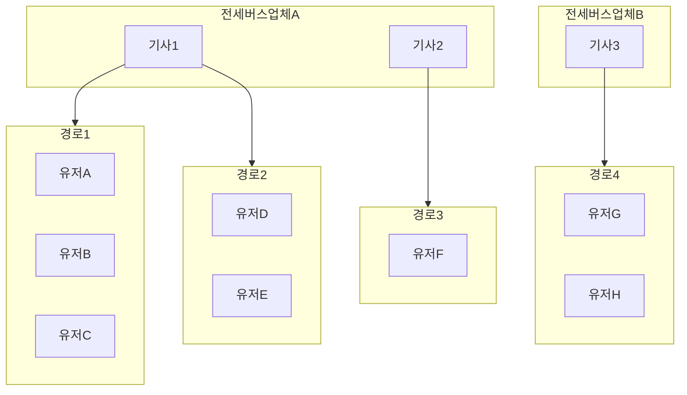
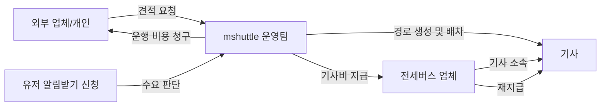
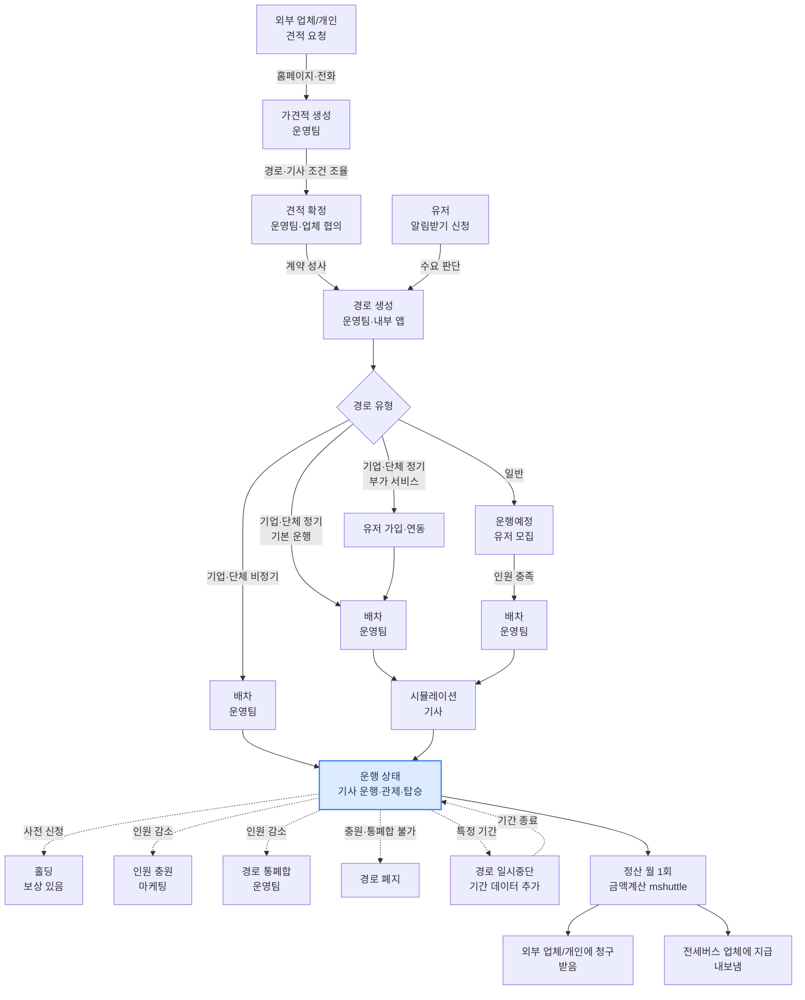

# mshuttle 서비스 전체 흐름

## 이 문서의 목적

mshuttle이 어떻게 돌아가는지 전체 그림을 이해하기 위한 문서입니다.

각 도메인의 상세 내용은 별도 문서를 참고하세요.

---

## mshuttle이란

mshuttle은 **공유셔틀을 운행하는 회사**입니다. 버스를 직접 소유하거나 기사를 직접 고용하지 않지만, 경로 생성부터 배차, 관제, 정산까지 운행 전반을 관리하며 운행에 대한 책임을 집니다.

공유셔틀 특성상 **스케줄링이 서비스의 핵심**입니다. 여러 유저가 같은 경로를 공유하고, 기사 한 명이 여러 경로를 담당할 수 있기 때문에 누가 언제 어디서 타는지를 얼마나 효율적으로 배치하느냐가 공차거리 최소화와 비용 합리성에 직결됩니다. 현재 스케줄링은 운영팀이 수동으로 판단하며, DB 쿼리를 통해 근거 데이터를 제공받아 의사결정에 활용합니다.

아래는 주체 간 관계의 예시입니다. 기사 한 명이 여러 경로를 담당하고, 각 경로에 여러 유저가 탑승하는 구조입니다.

**운행 관계 — 기사 한 명이 여러 경로를 담당하고, 각 경로에 여러 유저가 탑승합니다.**



**계약 및 정산 관계 — 경로는 외부 업체/개인의 견적 요청 또는 유저 수요에서 시작되며, 운행 후 정산이 양방향으로 이루어집니다.**



---

## 등장 주체

| 주체 | 설명 |
| --- | --- |
| **외부 업체/개인** | 셔틀 운행을 요청하는 고객. 견적 요청부터 계약, 운행 비용 지급까지 연결되는 주체. |
| **유저 (탑승자)** | 실제로 셔틀을 타는 사람. 홈페이지에서 알림받기 신청 및 탑승 신청. 전용 앱 없음. |
| **mshuttle 운영팀** | 경로 생성, 배차, 관제, 정산 등 전반적인 운영을 담당. 내부 앱 사용. |
| **기사** | 셔틀을 운행하는 사람. 전세버스 업체 소속이 대부분. 기사 전용 앱으로 탑승 체크 및 운행 데이터 전송. 회원가입이 원칙이나 나이 문제로 운영팀이 시스템에 직접 등록하는 경우가 많음. 한 명이 여러 경로를 담당하기도 함. |
| **전세버스 업체** | 기사가 소속된 업체. 운행 후 기사비 정산을 받는 대상. 업체가 기사에게 재지급. |

---

## 전체 흐름 구조도



### 전체 흐름 요약 표

| 단계 | 주요 주체 | 내용 | 비고 |
| --- | --- | --- | --- |
| 견적 요청 | 외부 업체/개인 | 홈페이지·전화로 셔틀 운행 요청 | 정기 또는 비정기 |
| 가견적 생성 | 운영팀, 외부 업체/개인 | 경로·기사 조건 생성, 업체와 조율 |  |
| 견적 확정 | 운영팀, 외부 업체/개인 | 협의 완료 후 계약 성사 |  |
| 수요 판단 | 유저 → 운영팀 | 알림받기 신청 → 수요 분석 | 정기만 |
| 경로 생성 | 운영팀 | 내부 앱으로 경로 생성 |  |
| 유저 모집 | 유저, 운영팀 | 웹 탑승 신청, 2일 무료 → 1달 전환 | 일반만 |
| 유저 가입·연동 | 유저, 운영팀 | mshuttle 가입 및 데이터 연동 | 기업·단체 부가 서비스 이용 시 |
| 배차 | 운영팀 | 기사 배정 | 운행예정·운행 상태 모두 발생 가능 |
| 시뮬레이션 | 기사 | 경로 사전 확인 | 정기만 |
| 기사 운행 | 기사 | 기사 앱 사용, 탑승 체크 | 일 1회 |
| 관제 | 운영팀, 시스템 | 실시간 운행 모니터링 | 일 1회, 정기만 |
| 탑승 | 유저 | 셔틀 탑승, 홀딩 신청 가능 | 일 1회 |
| 일시중단 | 운영팀 | 기간 데이터 추가로 운행 중단 | 기사비 해당 일자 차감 |
| 인원 감소 대응 | 운영팀 | 충원 → 통폐합 → 폐지 순 검토 |  |
| 정산 | 운영팀 | 금액 계산 및 청구·지급 | 월 1회 |

---

## 경로가 만들어지는 두 가지 경우

mshuttle의 모든 운행은 **경로**에서 시작합니다. 경로 생성은 운영팀이 내부 앱을 통해 진행합니다.

1. **견적 요청** — 외부 업체 또는 개인이 홈페이지나 전화로 셔틀 운행을 요청합니다. 요청이 접수되면 운영팀이 아래 순서로 견적을 처리합니다.

   - **가견적 생성** — 경로 및 기사 등 조건을 검토해 가견적을 작성하고, 업체/개인과 대화하며 조율합니다.

   - **견적 확정** — 협의가 완료되면 견적을 확정하고 계약을 성사시킵니다.

   - **경로 생성** — 계약 성사 후 정식 경로를 생성합니다. 정기(출퇴근 등) 또는 비정기(1회성) 운행으로 나뉩니다.

1. **수요 판단 (자체)** — 유저가 홈페이지 알림받기 기능으로 출발지·도착지·시간을 신청하면, 운영팀이 수요를 판단해 **정기 경로만** 생성합니다. 비정기 경로는 견적 요청이 있을 때만 만들어집니다.

→ 상세: 견적 | 경로

---

## 경로 상태 및 관리

경로는 두 가지 상태를 가집니다.

### 운행예정

유저를 모집하는 단계입니다.

- 유저 탑승 신청을 받습니다.
- 일정 인원이 모이면 배차를 진행합니다.
- 배차가 완료되면 **운행** 상태로 전환됩니다.

### 운행

실제로 운행이 이루어지는 단계입니다.

- 기사 운행 / 관제 / 탑승이 동시에 진행됩니다.
- 기사가 그만두는 경우 운행 상태에서도 배차가 발생합니다. 배차 완료 후 운행 상태를 유지합니다.
- 탑승 인원이 줄어드는 경우 인원 충원, 경로 통폐합, 경로 폐지 순으로 검토합니다.
- 일시중단이 필요한 경우 중단 기간 데이터를 추가해 해당 기간만 운행을 중단합니다.

**배차가 두 상태 모두에서 발생할 수 있지만 목적이 다릅니다.**

| 상태 | 배차 목적 |
| --- | --- |
| 운행예정 | 운행을 시작하기 위한 배차 |
| 운행 | 운행을 유지하기 위한 기사 교체 배차 |

### 일시중단

특정 기간 동안 경로 운행을 중단할 수 있습니다. 상태값이 바뀌는 것이 아니라 **중단 기간 데이터를 추가**하는 방식으로 처리됩니다. 기간이 종료되면 자동으로 재개됩니다. (예: 코로나 시기 전체 경로 일시중단)

일시중단 기간 동안 기사는 운행을 하지 않으므로, **해당 일자만큼 기사비 정산에서 차감**됩니다.

### 인원 감소 시 처리

운행 중 탑승 인원이 줄어드는 경우 아래 순서로 검토합니다.

1. **인원 충원** — 마케팅을 통해 신규 탑승자 모집
2. **경로 통폐합** — 운영팀이 여러 경로의 인원 및 이동경로 구조를 비교해 유사 경로를 합침. 기존 유저는 다른 경로로 이동 안내 후 처리.
3. **경로 폐지** — 위 방법이 모두 어려울 경우

---

## 배차 전까지의 흐름

경로가 생성된 후 배차로 이어지는 경로는 계약 유형에 따라 달라집니다.

### 기업/단체 — 정기

업체와 소통을 통해 다양한 작업 후 진행됩니다. 계약 체결 및 계약 후 관리는 별도 도메인으로 처리됩니다. → 기업/단체 계약

- **기본 운행만 이용** — 탑승자가 이미 확정되어 있으므로 유저 모집 없이 바로 배차로 진행합니다.
- **관제 등 부가 서비스 이용** — 탑승자 데이터 연동이 필요하므로 유저가 mshuttle에 가입해야 합니다. 가입 및 연동 완료 후 배차가 진행됩니다.

### 기업/단체 — 비정기

1회성 운행이므로 간단하게 진행됩니다. 유저 가입이 필요 없습니다.

### 일반 경로 — 운행예정 상태

경로 생성 후 유저를 모집하는 단계입니다.

- 유저는 홈페이지에서 탑승을 신청합니다.
- 일정 인원이 모이면 운영팀이 기사를 찾아 배차합니다.

### 일반 경로 — 운행 상태

배차 완료 후 실제 운행이 시작되는 단계입니다.

- 기사 운행 / 관제 / 탑승이 동시에 진행됩니다.
- 유저는 **2일 무료 체험** 후 1달 상품으로 전환할 수 있습니다.
- **1달 단위** 상품으로 운영되며, 탑승 종료 4일 전에 신규 데이터가 자동 생성되고 결제 요청 문자가 발송됩니다.
- 인원이 줄어들면 충원 → 통폐합 → 폐지 순으로 검토합니다.

→ 상세: 유저 신청 | 배차

---

## 시뮬레이션

배차가 완료되면 기사는 해당 경로에 대해 **시뮬레이션**을 진행합니다.

비정기 운행(1회성 여행 등)은 시뮬레이션을 진행하지 않습니다.

---

## 운행 상태에서 동시에 일어나는 일

"운행"은 경로의 상태값입니다. 운행 상태에서는 아래 세 도메인이 동시에 진행됩니다.

```
[운행 상태]
  ├── 기사 운행 — 기사가 앱을 사용해 셔틀 운행
  ├── 관제    — 운영팀·시스템이 실시간 모니터링 (정기만)
  └── 탑승    — 유저가 셔틀에 탑승
```

### 기사 운행

- 기사는 기사 전용 앱을 사용해 운행을 진행합니다.
- 앱 미사용 시 관제 데이터가 수집되지 않으므로 반드시 확인이 필요합니다.
- 탑승 체크는 기사가 앱을 통해 직접 진행합니다.

### 관제

- 운영팀은 관제 앱을 통해 실시간으로 운행 상태를 모니터링합니다.
- 비정기 운행은 관제를 진행하지 않습니다.

### 탑승

- 유저가 셔틀에 탑승합니다. 탑승 전용 앱은 없으며 탑승 체크는 기사가 진행합니다.
- **홀딩** — 특정 일자에 탑승이 불가한 경우 사전에 홀딩을 신청하면 그에 맞는 보상이 제공됩니다. 아무런 신청 없이 미탑승한 경우에는 보상이 없습니다.

→ 상세: 기사 운행 / 배차 | 관제 | 탑승

---

## 정산 (월 1회)

운행 실적을 기준으로 월 1회 정산이 이루어집니다. **금액 계산은 mshuttle이 전부 진행**합니다.

| 구분 | 방향 | 대상 | 담당 |
| --- | --- | --- | --- |
| 기업/단체 정산 | 받음 | 외부 업체/개인 (계약 업체) | 운영팀 |
| 기사비 정산 | 내보냄 | 전세버스 업체 | 운영팀 |

→ 상세: 정산

---

## 업무 흐름 분석

각 업무 단계 간의 관계를 구조화한 표입니다. 업무 개선 및 자동화 검토의 기초 자료로 활용할 수 있습니다.

| From | To | 트리거 | 주체 | 처리 방식 |
| --- | --- | --- | --- | --- |
| 견적 요청 | 가견적 생성 | 외부 업체/개인 요청 접수 시 | 외부 업체/개인 | 견적 요청 페이지로 접수 후 운영팀이 가견적 생성 |
| 가견적 생성 | 견적 확정 | 경로·기사 조건 조율 완료 시 | 운영팀, 외부 업체/개인 | 업체/개인과 대화·조율 후 견적 확정 |
| 견적 확정 | 경로 생성 | 계약 성사 시 | 운영팀 | 임시경로 기반으로 정식 경로 생성 |
| 알림받기 신청 | 경로 생성 | 주기적 수요 확인 후 충족 판단 시 | 운영팀 | 신청 페이지 → 지도 기능으로 수요 확인 |
| 경로 생성 | 유저 모집 | 일반 경로 생성 시 | 운영팀 | 관리자 기능 (문자 등) 활용 |
| 경로 생성 | 배차 | 기업·단체 기본 운행 계약 성사 시 | 운영팀 | 운영팀 직접 처리 |
| 유저 모집 | 배차 | 일정 인원 충족 시 | 운영팀 | 운영팀 확인 후 처리 |
| 배차 | 시뮬레이션 | 정기 경로 배차 완료 시 | 기사 | 앱 정보 기반으로 기사가 경로 점검 |
| 시뮬레이션 | 운행 | 시뮬레이션 완료 시 | 운영팀 | 운영팀 상태 전환 |
| 운행 | 기사 운행 | 매 운행일 | 기사 | 기사 앱 사용, 탑승 체크 |
| 운행 | 관제 | 매 운행일 | 운영팀, 시스템 | 실시간 운행 모니터링 |
| 운행 | 탑승 | 매 운행일 | 유저 | 셔틀 탑승 |
| 운행 | 정산 | 월말 | 운영팀 | 운행 중 입력된 데이터 기반으로 금액 계산. 정확한 데이터 입력이 정산 품질에 직접 영향. |
| 운행 | 배차 | 기사 교체 필요 시 (주기적 확인) | 운영팀 | 운영팀 직접 처리 |
| 운행 | 인원 충원 | 인원 감소 확인 시 (주기적 확인) | 운영팀 | 전화·문자 활용 |
| 운행 | 경로 통폐합 | 충원 어려울 경우 (주기적 확인) | 운영팀 | 관리자 기능으로 데이터 확인 후 처리 |
| 운행 | 경로 폐지 | 통폐합 불가 판단 시 | 운영팀 | 운영팀 직접 처리 |
| 탑승 | 홀딩 | 유저 사전 신청 시 | 유저 | 유저 신청 기반 처리 (신청 채널 별도 안내) |

---

## 도메인 구조

mshuttle 서비스는 아래 도메인으로 구성됩니다.

"운행"은 도메인이 아니라 **경로의 상태값**입니다. 운행 상태에서는 기사 운행, 관제, 탑승 세 도메인이 동시에 진행됩니다.

| 도메인 | 주요 주체 | 비고 | 문서 |
| --- | --- | --- | --- |
| 견적 | 외부 업체/개인 (요청), 운영팀 (처리) | 가견적 생성, 조건 조율, 견적 확정 | [견적](./domain/quotation/overview.md) |
| 기업/단체 계약 | 외부 업체/단체, 운영팀 | 계약 체결 및 계약 후 관리 | [기업/단체 계약](./domain/b2b/overview.md) |
| 경로 | 운영팀 | 상태 관리, 일시중단, 통폐합, 폐지 포함 | [경로](./domain/route/overview.md) |
| 유저 신청 / 탑승 | 유저, 운영팀 | 알림받기, 탑승 신청, 갱신, 홀딩 | [유저 신청 / 탑승](./domain/passenger/overview.md) |
| 배차 / 기사 | 운영팀, 전세버스 업체, 기사 | 기사 등록 관리, 시뮬레이션 포함 | [배차 / 기사](./domain/driver/overview.md) |
| 관제 | 운영팀, 시스템 | 정기 경로만 해당 | [관제](./domain/control/overview.md) |
| 정산 | 운영팀 | 기업 정산, 기사비 정산 | [정산](./domain/settlement/overview.md) |