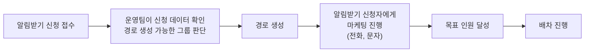
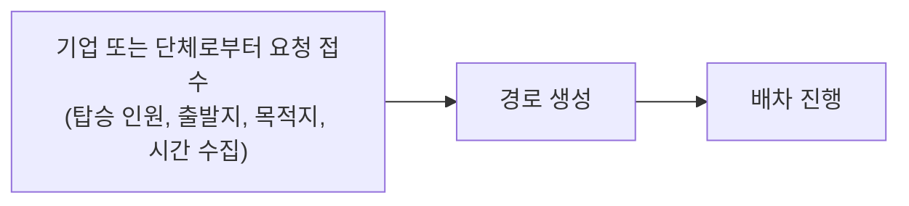
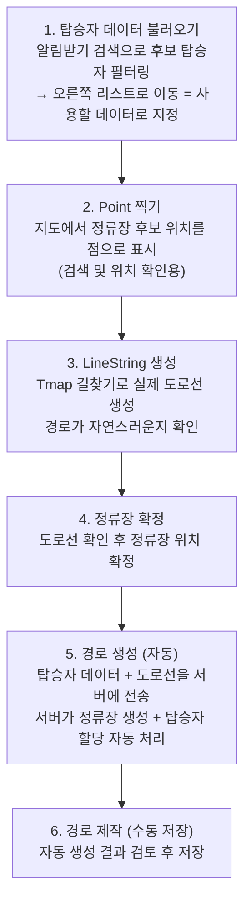
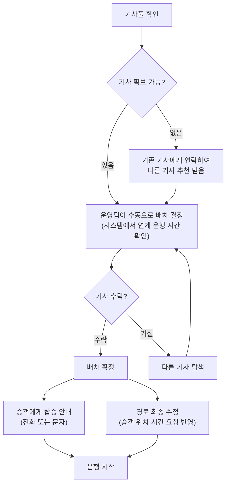

# 경로 제작 및 배차

> 운행이 시작되기까지의 전체 흐름을 설명합니다.

---

## 경로는 왜 만드나

mshuttle의 경로는 두 가지 이유로 만들어집니다.

하나는 **수요**입니다. 홈페이지에서 알림받기를 신청한 고객들의 집 위치, 회사 위치, 출퇴근 시간 정보를 바탕으로, 운영팀이 데이터를 직접 보면서 경로가 생길 수 있는 그룹을 판단합니다.

다른 하나는 **요청**입니다. 기업이나 단체가 먼저 셔틀 운행을 요청하는 경우로, 이미 탑승할 인원이 확보된 상태에서 시작합니다.

---

## 전체 흐름

### 수요 기반 경로

### 요청 기반 경로 (기업/단체)

> 요청 기반은 승객이 이미 모집된 상태이므로 마케팅 단계 없이 바로 배차로 넘어갑니다.

---

## 경로 제작 시스템 사용 순서

경로 제작은 관리자 시스템(경로제작 화면)에서 진행합니다. 아래 순서대로 진행해야 합니다.

---

## 지도에서 탑승자 데이터 보는 법

탑승자 탭 → 알림받기 검색에서 아래 조건으로 필터링합니다.

- **신청 기간** — 데이터를 조회할 기간 설정
- **시간 선택** — 해당 출근 시간대 신청자만 표시 (7:10 ~ 20:00 중 선택)
- **탑승지/하차지 지역** — 특정 지역으로 범위 제한

검색 후 지도에서 마커 색상으로 구분합니다.

- 🟢 **초록색** — 탑승지 (집, 출발 위치)
- 🔴 **빨간색** — 하차지 (회사, 도착 위치)

오른쪽 리스트로 옮긴 탑승자만 경로 생성에 사용됩니다. 왼쪽 목록은 후보, 오른쪽 목록은 확정 데이터입니다.

---

## 클러스터란 무엇인가

탑승자 화면에서 **클러스터 토글**을 켜면 가까운 위치의 신청자들이 자동으로 묶여서 지도에 표시됩니다.

시스템은 지도를 보이지 않는 **육각형 구역**으로 나눕니다. 같은 구역 또는 인접한 구역에 사는 신청자들이 하나의 그룹으로 묶입니다. 이 기준이 바로 경로가 만들어질 수 있는 그룹의 기초가 됩니다.

화면 상단의 **zoom(resolution)** 숫자로 육각형 구역의 크기를 조절할 수 있습니다.

| zoom 숫자     | 육각형 구역 크기 | 효과                            |
| ------------- | ---------------- | ------------------------------- |
| 숫자 클수록   | 좁아짐           | 더 가까운 사람들끼리만 묶임     |
| 숫자 작을수록 | 넓어짐           | 더 많은 사람이 한 그룹으로 묶임 |

클러스터를 이해하지 못하면 지도에서 어떤 그룹이 경로가 될 수 있는지 판단하기 어렵습니다. 반드시 클러스터 토글을 켠 상태에서 zoom을 조절하며 그룹을 확인하세요.

---

## 경로제작 폼 항목 설명

경로 생성 후 저장 시 아래 항목을 입력합니다. 잘못 설정하면 고객이 경로를 찾지 못하거나, 결제가 안 되거나, 운행이 안 되는 문제가 생깁니다.

| 항목                     | 의미                                            | 주의사항                                         |
| ------------------------ | ----------------------------------------------- | ------------------------------------------------ |
| **탑승지 / 탑승지 상세** | 출발 정류장 주소                                | 필수 입력                                        |
| **하차지 / 하차지 상세** | 도착 정류장 주소                                | 필수 입력                                        |
| **시간**                 | 운행 시간                                       | 출근/퇴근 방향에 맞게 설정                       |
| **결제**                 | 고객에게 요금을 받는 경로인지 여부              | B2B(기업 계약)는 보통 X, B2C(일반 고객)는 보통 O |
| **활성**                 | 경로를 현재 운영할지 여부                       | 비활성이면 고객 앱에 표시되지 않음               |
| **출퇴근**               | 출근 방향인지 퇴근 방향인지                     | 하나의 노선도 출근/퇴근을 별도 경로로 만듦       |
| **사업**                 | 일반 고객(B2C) 대상인지 기업 계약(B2B) 대상인지 | 정산 방식이 달라지므로 반드시 정확히 설정        |
| **좌석**                 | 고객이 앱에서 좌석을 직접 선택할 수 있는지 여부 | O이면 고객이 좌석 선택, X이면 자동 배정          |
| **검색**                 | 고객 앱에서 이 경로가 검색되는지 여부           | X이면 링크로만 접근 가능, 검색 결과에 미노출     |
| **경로추천 등록**        | 경로 추천 시스템에 포함할지 여부                | 추후 별도 등록                                   |

---

## 배차 흐름

수요 기반이든 요청 기반이든 배차 과정은 동일합니다.

---

## 배차 시 주의사항

### 연계 운행 고려

기사 한 명이 하루에 여러 경로를 연속으로 운행할 수 있도록 배차합니다. 경로 간 시간과 위치를 맞추면 기사가 빈 차로 이동하는 거리(공차)를 줄일 수 있습니다.

시스템에서 기사별 운행 시간을 확인할 수 있는 화면을 제공하므로, 배차 전 반드시 확인합니다.

### 경로 최종 수정

경로는 승객의 실제 위치와 시간 요청을 최대한 반영하여 확정합니다. 배차 후에도 운행 시작 전까지 수정이 가능합니다.

---

## 관련 업무

- 운행이 시작된 이후의 흐름은 **관제** 문서를 참고하세요.
- 기업/단체 요청으로 시작된 경우 계약 관련 내용은 **B2B** 문서를 참고하세요.
- 정산은 배차 확정 이후 운행 데이터를 기반으로 진행됩니다. **정산** 문서를 참고하세요.
