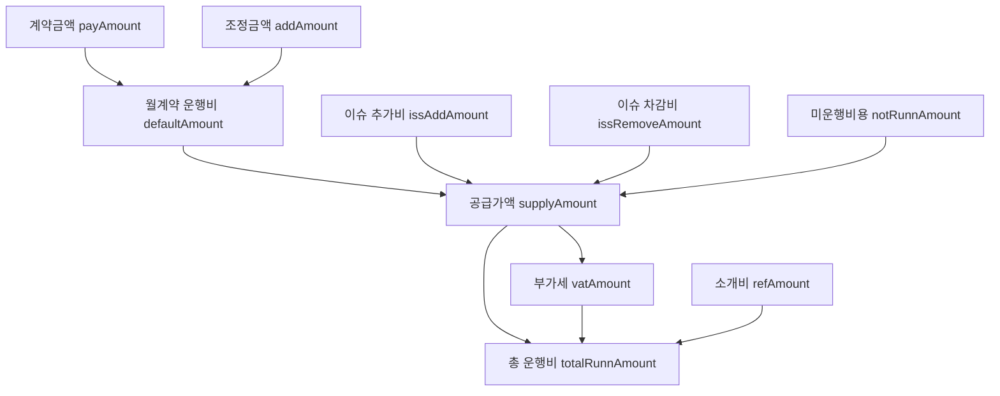

# 정산 (Settlement)

운행 실적을 기준으로 **월 1회** 진행되는 재정 정산.

## 정산 방향

### 1. 기업/단체 정산 (받음)
- **대상**: 외부 업체/개인 (계약 업체)
- **담당**: 운영팀
- **내용**: 계약한 운행 비용 청구

### 2. 기사비 정산 (내보냄)
- **대상**: 전세버스 업체
- **담당**: 운영팀
- **내용**: 기사 운행 비용 지급
  - 전세버스 업체가 기사에게 재지급

## 계산 공식

### 최종 공식 요약

```
totalRunnAmount = supplyAmount + vatAmount + etcAmount + refAmount
```

### 단계별 계산



| 단계 | 항목 | 공식 |
|------|------|------|
| 1 | 월계약 운행비 | `payAmount + addAmount` |
| 2 | 미운행비용 | `floor(-1 × defaultAmount × (제외일+미운행일) / 월일수)` |
| 3 | 공급가액 | `defaultAmount + issAdd + issRemove + notRunnAmount` |
| 4 | 부가세 | 과세: `round(supplyAmount × 0.1)`, 면세: `0` |
| 5 | 총 운행비 | `supplyAmount + vatAmount + etcAmount + refAmount` |

### 일수 계산

```
실 운행일 = 월 총일수 - 총 미운행일 - 제외일
총 미운행일 = 운행중단일 + 이슈 미운행일
제외일 = 월 총일수 - 캘린더 운행일수
```

## 정산 기간

`setlStartDay`(정산 시작일)에 따라 기간이 결정:

- **10일 이하**: 당월 시작 (예: 3월 5일 ~ 4월 4일)
- **10일 초과**: 전월 시작 (예: 2월 15일 ~ 3월 14일)

## 특수 상황

### 운행중단 (Route Pause)
- 경로 일시중단 기간 동안 기사는 운행하지 않음
- **해당 일자만큼 기사비 정산에서 차감** (`pauseDay` → `notRunnAmount`)

### 이슈 미운행
- 기사 이슈로 인한 미운행일 집계 (`removeDay`)
- `setlDayCd`에 따라 카운트 방식 분기:
  - `setlDayCd=1`: 모든 날 카운트
  - `setlDayCd=0`: 미운행일(`runnCd=0`)만 카운트

### 이슈 금액 조정
- **추가비** (`sign=1`): 정산에 가산
- **차감비** (`sign=0`): 정산에서 차감

### 홀딩
- 유저가 사전에 홀딩 신청 → 보상 제공
- 무신청 미탑승 → 보상 없음

## 정산 상태 흐름


- **미정산** (`setlCd="b"`): 정산 버튼 활성
- **정산완료** (`setlCd="a"`): 취소 가능
- **이체완료** (`transferYn=1`): 잠금 (변경 불가)

## 운행 상태 분류

| 상태 | 조건 |
|------|------|
| 기존 | 기본값 |
| 신규 | 경로시작일이 정산기간 내 |
| 폐지 | 폐지일이 정산기간 내 |
| 신규&폐지 | 기간 내 시작 + 폐지 모두 발생 |

## 운영 영향

정산 정확도는:
- 기사 운행 데이터 품질 (앱 사용률)
- 관제 모니터링 (정기만)
- 탑승 체크 정확도
에 모두 영향받음

## 관련 개념

- [경로 상태](../concepts/operation-state.md) — 일시중단과 정산의 관계
- [기사 운행](../concepts/driver-operation.md) — 데이터 입력 품질
- [정산 계산 로직 (코드)](../sources/settlement-calc-code.md) — 상세 코드 분석

---

**출처:**
- [mshuttle 서비스 전체 흐름](../sources/mshuttle-overview.md)
- [정산 계산 로직 (코드 분석)](../sources/settlement-calc-code.md)
