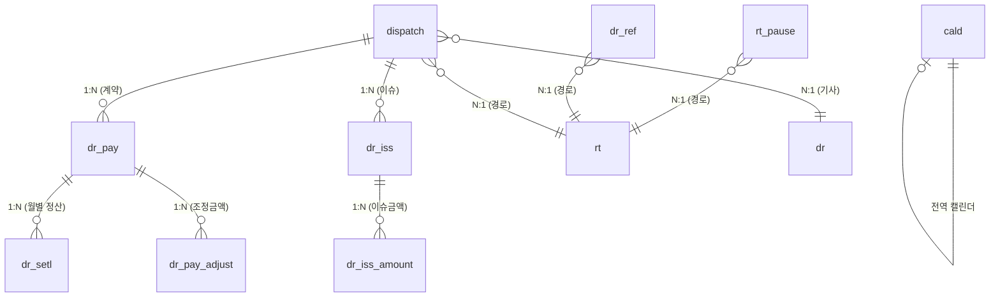
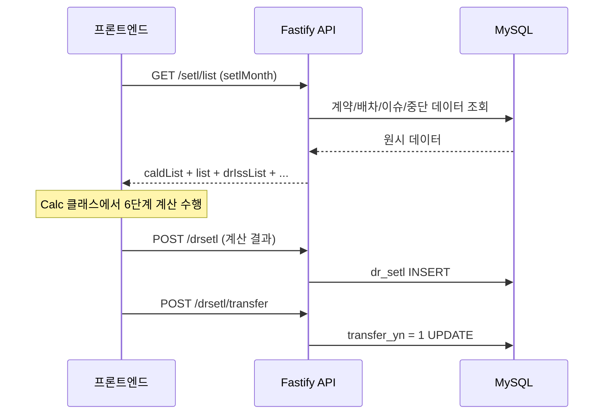

# 정산 계산 로직 (코드 분석)

관리자 페이지의 정산(Setl) 모듈 코드 분석 결과.

## 핵심 데이터 모델

### ICalcRes (계산 결과)

| 필드 | 의미 |
|------|------|
| `totalRunnAmount` | 총 운행비 (최종 지급액) |
| `payAmount` | 계약금액 |
| `defaultAmount` | 월계약 운행비 |
| `supplyAmount` | 공급가액 |
| `vatAmount` | 부가세 |
| `refAmount` | 소개비 |
| `monthDayCnt` | 월 운행일 (정산 기간 총 일수) |
| `runnDayCnt` | 실 운행일 |
| `notRunnDayCnt` | 총 미운행일 |
| `pauseDay` | 운행중단일 |
| `removeDay` | 이슈 미운행일 |
| `exceptDayCnt` | 제외일 |
| `notRunnAmount` | 미운행비용 |
| `issAddAmount` | 이슈 추가비 |
| `issRemoveAmount` | 이슈 차감비 |
| `runnStatus` | 운행 상태 (기존/신규/폐지) |
| `vatCd` | 부가세 코드 (a=과세, b=면세) |

### 관련 엔티티 (프론트 인터페이스 ↔ DB 테이블 매핑)

| 프론트 인터페이스 | DB 테이블 | 역할 |
|------------------|-----------|------|
| `IDrPay` | `mshuttle.dr_pay` | 기사 계약 — `amount`, `setl_day_cd`, `setl_start_day` |
| `IDrSetl` | `mshuttle.dr_setl` | 정산 기록 — `vat_cd`, `transfer_yn`, 계산 결과 저장 |
| `ICald` | `mshuttle.cald` | 운행 캘린더 — `day`, `runn_cd`, `is_holiday` |
| `IRtPause` | `mshuttle.rt_pause` | 경로 중단 — `start_day`, `end_day`, `pause_cd` |
| `IDrIss` | `mshuttle.dr_iss` | 기사 이슈 — `dispatch_id`, `iss_cd`, `start_day`, `end_day` |
| `IDrIssAmount` | `mshuttle.dr_iss_amount` | 이슈 금액 — `sign` (1=추가, 0=차감), `amount` |
| `IDrPayAdjust` | `mshuttle.dr_pay_adjust` | 조정금액 — `amount`, 적용기간(`setl_start/end_month`) |
| `IDrRef` | `mshuttle.dr_ref` | 소개비 — `amount`, `ref_dr_id` |

## 계산 공식

### 1단계: 기본 금액 산출

```
payAmount     = drPay.amount                    (계약금액)
addAmount     = sum(drPayAdjust[*].amount)       (조정금액)
defaultAmount = payAmount + addAmount            (월계약 운행비)
```

### 2단계: 일수 계산

```
monthDayCnt   = 정산 기간 내 총 일수
exceptDayCnt  = monthDayCnt - monthCaldList.length  (제외일)
pauseDay      = 경로 중단 기간의 일수               (운행중단일)
removeDay     = 이슈로 인한 미운행 일수              (이슈 미운행일)
notRunnDayCnt = pauseDay + removeDay               (총 미운행일)
runnDayCnt    = monthDayCnt - notRunnDayCnt - exceptDayCnt  (실 운행일)
```

### 3단계: 미운행비용 계산

```
notRunnAmount = floor(-1 * defaultAmount * (exceptDayCnt + notRunnDayCnt) / monthDayCnt)
```

- 항상 0 이하 (차감)
- 월계약 운행비를 일할 계산하여 미운행일만큼 차감

### 4단계: 이슈 금액

```
issAddAmount    = sum(drIssAmount where sign=1)     (이슈 추가비)
issRemoveAmount = -sum(drIssAmount where sign=0)    (이슈 차감비, 음수)
```

### 5단계: 공급가액 및 부가세

```
supplyAmount = defaultAmount + issAddAmount + issRemoveAmount + notRunnAmount
vatAmount    = (vatCd === "a") ? round(supplyAmount * 0.1) : 0
```

### 6단계: 최종 금액

```
refAmount        = sum(drRef[*].amount)              (소개비)
totalRunnAmount  = supplyAmount + vatAmount + etcAmount + refAmount  (총 운행비)
```

## 정산 기간 결정

`drPay.setlStartDay` 기준:

```
if setlStartDay <= 10:
    firstDay = 정산월-setlStartDay일
else:
    firstDay = (전월)-setlStartDay일

lastDay = firstDay + 1개월 - 1일
```

예시: setlMonth="2024-03", setlStartDay=15
- firstDay = 2024-02-15
- lastDay = 2024-03-14

## 특수 케이스 처리

### 운행중단 (Route Pause)
- `IRtPause`의 `startDay`~`endDay` 범위 내 캘린더 일수 집계
- `pauseDay`에 반영 → `notRunnAmount` 차감

### 이슈 미운행 (Issue Non-operation)
- `IDrIss`의 기간 내 캘린더 일수
- `setlDayCd=1`: 모든 날 카운트
- `setlDayCd=0`: `runnCd=0`인 날만 카운트
- `removeDay`에 반영

### 이슈 금액 조정
- `IDrIssAmount`의 `sign=1` → 추가비
- `IDrIssAmount`의 `sign=0` → 차감비

### 운행 상태 (runnStatus)

```
기본값 = "기존"
if 경로시작일 >= 정산기간시작일 AND <= 정산기간종료일:
    "신규" (+ 기간 내 폐지 시 "신규&폐지")
elif 폐지일 <= 정산기간종료일:
    "폐지"
```

## 정산 상태 흐름


- `drSetlId` 없음 → 미정산 → "정산" 버튼
- `drSetlId` 있음 + `transferYn !== 1` → 정산완료 → "정산 취소" 버튼
- `transferYn === 1` → 이체완료 → 액션 불가

## 데이터 처리 흐름

1. API에서 원시 데이터 로드 (`ResGetSetl_List`)
2. `drIssList` → `dispatchId`로 그룹핑
3. `rtPauseList` → `rtId`로 그룹핑
4. `drPayAdjustList` → `drPayId`로 그룹핑
5. `drRefList` → `rtId_drId`로 그룹핑
6. `drIssAmountList` → `drIssId→dispatchId` 매핑
7. 각 정산 레코드마다 `Calc` 객체 생성
8. `makeRow()`로 테이블 행 포맷팅

## 필터링/분류

| 코드 | 의미 |
|------|------|
| `setlCd = "b"` | 정산미완료 |
| `setlCd = "a"` | 정산완료 |
| `vatCd = "a"` | 과세 (VAT 10%) |
| `vatCd = "b"` | 면세 (VAT 0%) |

## DB 스키마 (실제 테이블)

### mshuttle.dr_pay (기사 계약금액)

| 칼럼 | 타입 | 설명 |
|------|------|------|
| `dr_pay_id` | INT PK | 기사 계약금액 ID |
| `dispatch_id` | INT | 배차 ID |
| `start_setl_month` | VARCHAR | 시작 정산월 |
| `setl_start_day` | VARCHAR | 정산 시작일자 |
| `setl_day_cd` | INT | 정산 일자 구분 |
| `rt_id` | VARCHAR | 경로 ID |
| `dr_id` | VARCHAR | 기사 ID |
| `amount` | INT | 계약금액 |
| `bus_compn_id` | INT | 버스 업체 ID |
| `borrow_setl_cd` | VARCHAR | 대차 구분 |

### mshuttle.dr_setl (정산 기록)

| 칼럼 | 타입 | 설명 |
|------|------|------|
| `dr_setl_id` | INT PK | 기사정산 ID |
| `dr_pay_id` | INT FK | 기사계약금 ID |
| `setl_month` | VARCHAR | 정산월 |
| `start_day` / `end_day` | VARCHAR | 정산 기간 |
| `pay_amount` | INT | 계약금액 |
| `add_amount` | INT | 추가 금액 |
| `default_amount` | INT | 기본금액 (=pay+add) |
| `runn_day_cnt` | INT | 운행일 수 |
| `not_runn_day_cnt` | INT | 미운행일 수 |
| `except_day_cnt` | INT | 예외일 수 |
| `not_runn_amount` | INT | 미운행 금액 |
| `iss_add_amount` | INT | 이슈 추가액 |
| `iss_remove_amount` | INT | 이슈 제외액 |
| `supply_amount` | INT | 공급가액 |
| `vat_amount` | INT | 부가세 |
| `vat_cd` | VARCHAR | 과세구분 (a/b) |
| `etc_amount` | INT | 기타 금액 |
| `ref_amount` | INT | 소개비 |
| `total_runn_amount` | INT | 총운행비 (최종) |
| `setl_cd` | VARCHAR | 정산 구분 (a=완료, b=미완료) |
| `transfer_yn` | INT | 이체여부 |
| `biz_cd` | INT | 비즈니스 구분 |

### mshuttle.cald (운행 캘린더)

| 칼럼 | 타입 | 설명 |
|------|------|------|
| `cald_id` | INT PK | 달력 ID |
| `day` | VARCHAR | 날짜 |
| `runn_cd` | INT | 운행구분 (0=미운행, 1=운행) |
| `is_holiday` | INT | 공휴일 여부 |

### mshuttle.rt_pause (경로 일시중단)

| 칼럼 | 타입 | 설명 |
|------|------|------|
| `rt_pause_id` | INT PK | 경로 일시중단 ID |
| `rt_id` | VARCHAR | 경로 ID |
| `pause_cd` | INT | 일시중단 구분 |
| `start_day` / `end_day` | VARCHAR | 중단 기간 |

### mshuttle.dr_iss (기사 이슈)

| 칼럼 | 타입 | 설명 |
|------|------|------|
| `dr_iss_id` | INT PK | 기사 이슈 ID |
| `dispatch_id` | INT | 배차 ID |
| `rt_id` | VARCHAR | 경로 ID |
| `dr_id` | VARCHAR | 기사 ID |
| `iss_cd` | VARCHAR | 이슈 구분 |
| `start_day` / `end_day` | VARCHAR | 이슈 기간 |
| `setl_month` | VARCHAR | 정산월 |
| `runn_iss_id` | INT | 운행 이슈 ID |
| `admin_check_cd` | VARCHAR | 관리자 체크 여부 |

### mshuttle.dr_iss_amount (이슈 금액)

| 칼럼 | 타입 | 설명 |
|------|------|------|
| `dr_iss_amount_id` | INT PK | 기사 이슈 정산 ID |
| `dr_iss_id` | INT FK | 기사 이슈 ID |
| `sign` | INT | 부호 (1=추가, 0=차감) |
| `amount` | INT | 금액 |
| `iss_amount_cd` | VARCHAR | 이슈 금액 구분 |
| `board_reward_ids` | JSON | 탑승 보상 ID 배열 |

### mshuttle.dr_pay_adjust (조정금액)

| 칼럼 | 타입 | 설명 |
|------|------|------|
| `dr_pay_adjust_id` | INT PK | 기사 조정금액 ID |
| `dr_pay_id` | INT FK | 기사 계약금액 ID |
| `amount` | DOUBLE | 금액 |
| `setl_start_month` / `setl_end_month` | VARCHAR | 적용 기간 |
| `dr_pay_cond_id` | INT | 계약 조건 ID |

### mshuttle.dr_ref (소개비)

| 칼럼 | 타입 | 설명 |
|------|------|------|
| `dr_ref_id` | INT PK | 기사 추천 ID |
| `amount` | INT | 금액 |
| `setl_month` | VARCHAR | 정산월 |
| `dr_id` | VARCHAR | 기사 ID |
| `ref_dr_id` | VARCHAR | 추천 기사 ID |
| `rt_id` | VARCHAR | 경로 ID |

### mshuttle.dispatch (배차)

| 칼럼 | 타입 | 설명 |
|------|------|------|
| `dispatch_id` | INT PK | 배차 ID |
| `rt_id` | VARCHAR | 경로 ID |
| `dr_id` | VARCHAR | 기사 ID |
| `start_day` | VARCHAR | 시작일 |
| `end_day` | VARCHAR | 종료일 |
| `dispatch_cd` | VARCHAR | 배차 구분 |
| `deploy_yn` | INT | 배포 여부 |
| `runn_mode_cd` | VARCHAR | 운행 모드 |
| `runn_group_dispatch_id` | INT | 운행그룹 배차 ID |

## 테이블 관계도



## 보충 설명

### cald (캘린더)
- **전역 캘린더** — 특정 경로/배차에 종속되지 않음
- 경로별 운행 요일은 `runn_cald_schd` (운행 스케줄) 테이블로 관리
- `runn_cald_schd_dtl`은 보조 테이블

### orgList
- 서비스를 제공하는 업체 (기업/단체) 정보
- 기사비 정산과 직접 연결되지 않음

### runnCaldSchd / runnCaldSchdDtl
- 해당 경로가 **어느 요일에 운행하는지** 정의
- 캘린더(cald)와 조합하여 실제 운행일 판단

## 백엔드 API (Fastify)

**소스:** `/Users/gimpilsu/psapp/admin/be/admin-drcal-restapi/`

### 핵심 아키텍처

**계산은 프론트엔드에서 수행, 백엔드는 데이터 조회 + 결과 저장만 담당.**

### API 엔드포인트

#### 정산 데이터 조회 (GET)

| 엔드포인트 | 설명 | 핵심 파라미터 |
|-----------|------|-------------|
| `GET /setl` | 정산 상세 조회 | setlMonth, drPayId, bizCd |
| `GET /setl/list` | 정산 목록 (계산용 데이터 전체) | setlMonth, busCompnId, setlCd |
| `GET /drsetl` | 기사 정산 상세 | drSetlId |
| `GET /drsetl/list` | 기사 정산 목록 | setlMonth, bizCd |

`GET /setl/list` 응답에 포함되는 데이터:
- `caldList` — 운행 캘린더
- `list` — 경로/배차/기사/계약/정산 정보
- `drIssList` — 기사 이슈
- `drIssAmountList` — 이슈 금액
- `drPayAdjustList` — 조정금액
- `rtPauseList` — 경로 중단
- `drRefList` — 소개비

#### 정산 등록/수정/삭제

| 엔드포인트 | 설명 |
|-----------|------|
| `POST /drsetl` | 단건 정산 등록 |
| `POST /drsetl/list` | 일괄 정산 등록 (월말 배치) |
| `PUT /drsetl` | 정산 수정 |
| `DELETE /drsetl` | 정산 삭제 (이체 전만 가능) |
| `DELETE /drsetl/list` | 일괄 삭제 |

#### 이체 처리

| 엔드포인트 | 설명 |
|-----------|------|
| `POST /drsetl/transfer` | 단건 이체 (transfer_yn → 1) |
| `POST /drsetl/transfer/list` | 일괄 이체 |

#### 소개비

| 엔드포인트 | 설명 |
|-----------|------|
| `POST /drsetl/ref` | 소개비 정산 등록 (bizCd=2) |
| `PUT /drref/setlMonth` | 소개비 정산월 변경 |

### 서비스 레이어

| 파일 | 역할 |
|------|------|
| `Setl2Service.ts` | 정산 데이터 조회 (cal, period, findIss, findAdjust, findRtPause) |
| `DrSetlService.ts` | 정산 CRUD (insert, update, delete, transfer) |

### 데이터 흐름



### 비즈니스 규칙 (서버측)

- **중복 방지:** 같은 drPayId + setlMonth 조합 중복 등록 불가
- **삭제 제한:** `transfer_yn = 0`인 경우만 삭제 가능
- **bizCd 구분:** 0=일반, 1=변형, 2=소개비

### 참고: dr_pay_adjust.amount

DB 스키마에서 `DOUBLE` 타입으로 정의되어 있으나, 다른 금액 필드는 모두 `INT`.
**이것은 실수로 추정됨** — 실제로는 INT로 처리해야 할 가능성 높음.

---

**출처:**
- admin_drcal/src/pages/Setl/Setl/ 프론트엔드 코드 분석 (2026-04-24)
- admin-drcal-restapi/ 백엔드 코드 분석 (2026-04-24)
- DB 스키마 (mshuttle.*) 직접 제공 (2026-04-24)
